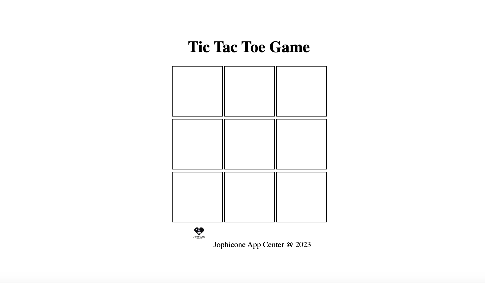

# Tic-Tac-Toe

Welcome to the Tic Tac Toe game by Jophicone App Center!

## Description

This is a text-based version of the classic Tic Tac Toe game. It allows two players to take turns making moves on a 3x3 grid. The first player to get three of their symbols in a row (horizontally, vertically, or diagonally) wins the game.

## Features

- Text-based interface.
- Two-player gameplay.
- Simple and intuitive design.

## How to Play

1. Clone the repository to your local machine.
2. Open the terminal and navigate to the project directory.
3. Run the game by executing a command like `python tic_tac_toe.py` (replace with the actual command for your language).

## Game Rules

- Players take turns to place their symbols on the grid.
- The game ends when one player has three symbols in a row or when the grid is full (resulting in a tie).
- After the game ends, you can choose to play again.

## Technologies Used

- HTML
- CSS
- JavaScript

## Screenshots

## Contributing

If you'd like to contribute to this project, please follow these steps:

1. Fork the repository.
2. Create a new branch for your feature: `git checkout -b feature-name`.
3. Commit your changes: `git commit -m 'Add some feature'`.
4. Push to the branch: `git push origin feature-name`.
5. Submit a pull request.

## License

This project is licensed under the LICENSE - see the [LICENSE.md](./LICENSE) file for details.
## Acknowledgments

- **Tic Tac Toe Game by Jophicone App Center**

  Thank you for visiting! Feel free to play the Tic Tac Toe game on this page. However, please note that the code is the intellectual property of Jophicone App Center. You are welcome to enjoy the game here, but we kindly request that you do not copy or reproduce the code elsewhere without permission.

